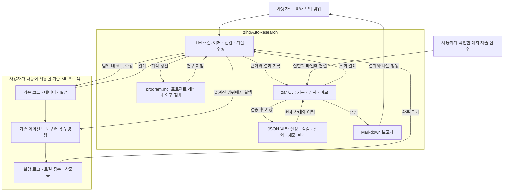

# zihoAutoResearch

**LLM이 기존 ML 프로젝트를 이해하고 전처리·학습·검증을 점검하며, 코드 수정과 실험을 반복하도록 돕는 가벼운 연구 도구.**

사용자가 선택한 기존 환경과 실행 명령을 활용합니다. 대회에서는 주최측 데이터·평가 지표·제출 규칙을 읽고, 로컬 검증 결과와 제출 점수를 실험 변경에 연결합니다. Docker나 별도 실행 플랫폼은 초기 범위에 포함하지 않습니다.

## 작업 흐름

프로젝트 이해 → 연구 지침 작성 → 현재 실험 점검 → 유효한 기준 확보 → 가설·코드 수정 → 실행·비교 → 유지·되돌리기·보류 → 다음 실험

카파시의 AutoResearch에서 작은 연구 지침과 반복 실험 방식을 가져옵니다. 여기에 기존 프로젝트 이해, 전처리·학습의 근거 기반 점검, 제출 결과 연결을 보완합니다. 전체 파이프라인을 연구 대상으로 삼으며 특정 데이터셋에 제품을 고정하지 않습니다.

## 아키텍처

아래는 구현할 v1 구조입니다. 스킬은 프로젝트를 해석하고 판단하며, CLI는 기록·형식 검사·비교를 담당합니다.

CLI는 LLM 호출·학습 실행·코드 되돌리기·대회 제출을 수행하지 않습니다. 실제 사용 중 실행은 기존 에이전트 도구가 맡으며, 도구 개발 검증에서는 로그와 점수를 모의 데이터로 대체합니다.

## 현재 상태

설계·Markdown 템플릿·v1 CLI/파일 계약·모의 JSON 예제가 있습니다. CLI와 LLM용 스킬은 아직 구현되지 않았습니다. 템플릿만으로 검사가 자동 수행되거나 모델 성능이 보장되지는 않습니다.

- [현재 제품 정의](docs/product-direction.md)
- [v1 사용 흐름·CLI·파일 계약](docs/cli-and-file-contract.md)
- [실제 학습 없이 확인하는 모의 파일 예제](examples/contract-v1/README.md)
- [연구 절차와 판정 규칙](docs/research-workflow.md)
- [기존 프로젝트 연결과 실행 환경](docs/project-adapter-and-environment.md)
- [프로젝트 연구 지침 템플릿](templates/program.md)
- [실험 기록 템플릿](templates/experiment.md)
- [작업 기록](tasks/todo.md)

목표는 사용자가 적용할 수 있는 도구를 완성하는 것입니다. 다음 단계는 v1 계약에 따라 스킬과 CLI를 구현하고 샘플 파일·가짜 실행 결과로 기능을 검증하는 것입니다. 제품 개발 중 실제 ML 학습·대회 제출은 하지 않으며, 완성 후 실제 적용은 사용자가 수행합니다.
