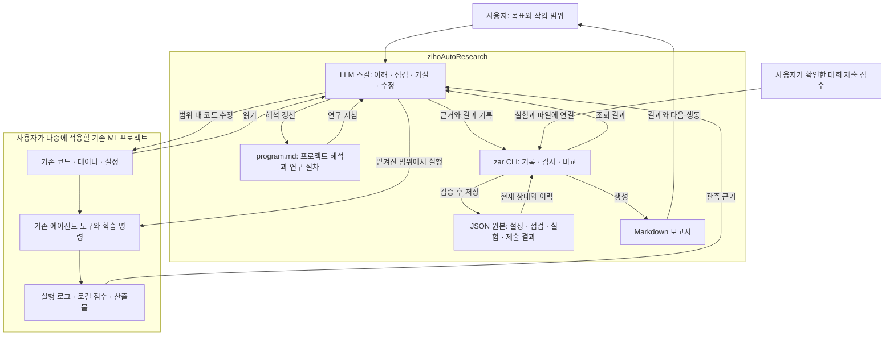

# zihoAutoResearch

**LLM이 기존 ML 프로젝트를 이해하고 전처리·학습·검증을 점검하며, 코드 수정과 실험을 반복하도록 돕는 가벼운 연구 도구.**

사용자가 선택한 기존 환경과 실행 명령을 활용합니다. 대회에서는 주최측 데이터·평가 지표·제출 규칙을 읽고, 로컬 검증 결과와 제출 점수를 실험 변경에 연결합니다. Docker나 별도 실행 플랫폼은 초기 범위에 포함하지 않습니다.

## 작업 흐름

프로젝트 이해 → 연구 지침 작성 → 현재 실험 점검 → 유효한 기준 확보 → 가설·코드 수정 → 실행·비교 → 유지·되돌리기·보류 → 다음 실험

카파시의 AutoResearch에서 작은 연구 지침과 반복 실험 방식을 가져옵니다. 여기에 기존 프로젝트 이해, 전처리·학습의 근거 기반 점검, 제출 결과 연결을 보완합니다. 전체 파이프라인을 연구 대상으로 삼으며 특정 데이터셋에 제품을 고정하지 않습니다.

## 아키텍처

아래는 구현할 v1 구조입니다. 스킬은 프로젝트를 해석하고 판단하며, CLI는 기록·형식 검사·비교를 담당합니다.



CLI는 LLM 호출·학습 실행·코드 되돌리기·대회 제출을 수행하지 않습니다. 실제 사용 중 실행은 기존 에이전트 도구가 맡으며, 도구 개발 검증에서는 로그와 점수를 모의 데이터로 대체합니다.

## 현재 상태

로컬 CLI의 JSON 저장·검증 기반과 `init`, `project set`, `status`, `check`, `experiment create/update`를 구현했습니다. LLM용 스킬, 리뷰·제출 기록 추가, 실험 비교·판정과 보고서 생성은 후속 구현 범위입니다. `check`는 기록의 형식·연결·근거 파일을 검사하며 ML 과정의 타당성을 판정하지 않습니다.

- [현재 제품 정의](docs/product-direction.md)
- [v1 사용 흐름·CLI·파일 계약](docs/cli-and-file-contract.md)
- [실제 학습 없이 확인하는 모의 파일 예제](examples/contract-v1/README.md)
- [연구 절차와 판정 규칙](docs/research-workflow.md)
- [기존 프로젝트 연결과 실행 환경](docs/project-adapter-and-environment.md)
- [프로젝트 연구 지침 템플릿](templates/program.md)
- [실험 기록 템플릿](templates/experiment.md)
- [작업 기록](tasks/todo.md)

목표는 사용자가 적용할 수 있는 도구를 완성하는 것입니다. 다음 단계는 실험 비교·판정 명령을 구현하고 LLM용 스킬과 연결하는 것입니다. 제품 개발 중 실제 ML 학습·대회 제출은 하지 않으며, 완성 후 실제 적용은 사용자가 수행합니다.

## 설치와 기본 사용

Python 3.11 이상이 필요하며 실행 시 외부 라이브러리는 필요하지 않습니다. 저장소에서 가상환경을 만든 뒤 설치합니다.

```sh
python -m venv .venv
# Linux/macOS
source .venv/bin/activate
# Windows PowerShell에서는 .venv\Scripts\Activate.ps1
python -m pip install .
zar init --project /path/to/ml-project
zar status --project /path/to/ml-project
```

초기화는 `.autoresearch/`만 생성하고 기존 코드·루트 `program.md`·`AGENTS.md`를 보존합니다. `--project`를 생략하면 현재 폴더를 사용하며 상위 폴더를 탐색하지 않습니다.

생성된 `.autoresearch/project.json`을 별도 파일로 복사해 목표·비교 조건·명령·예산·수정 허용 경로를 채웁니다. `environment.os`는 사용자가 `windows`, `linux`, `macos`, `other` 중 선택하고 `runtime`, `device`도 직접 기록합니다. 기록된 명령은 실행하지 않습니다.

```sh
zar project set --project /path/to/ml-project --file edited-project.json
zar status --project /path/to/ml-project --json
zar check --project /path/to/ml-project --json
```

`project set`은 현재 revision의 전체 수정본을 받아 검증 후 revision을 올립니다. ID·생성 시각은 유지하고 updated_at은 CLI가 기록합니다. 같은 comparison ID의 조건을 바꾸려면 새 ID를 지정합니다. 미완성 설정도 저장할 수 있으며 `status`는 누락을 보여주고 `check`는 종료 코드 3을 반환합니다. 성공은 0, 인자·형식 오류는 2, 상태·참조 충돌은 3, 파일·잠금 오류는 4입니다.

CLI는 `.autoresearch/.lock`으로 동시 접근을 조정하며 잠금이 있으면 자동 삭제하지 않습니다. 중단으로 잠금이 남으면 실행 중인 CLI가 없는지 확인한 뒤 수동으로 복구합니다. `init`은 프로젝트 루트의 `.autoresearch.init.lock`을 사용합니다. CLI 밖의 동시 파일 편집은 보호하지 않습니다.

`check`는 저장된 review/experiment/submission 파일도 검사합니다. 파일 근거의 누락·해시 미기록·변경과 확인하지 못한 코드/데이터 최신성은 진단으로 표시하고 URL에 접속하지 않습니다. 실제 ML 실행이나 제출 없이 테스트합니다.

```sh
python -m unittest discover -s tests -v
```

현재 실행 검증 환경은 macOS입니다. Windows/Linux 실기기 동작은 아직 확인하지 않았습니다. 아키텍처 그림은 후속 기능까지 포함한 v1 목표 구조입니다.

## 실험 생성과 관측 결과 기록

설정을 채운 프로젝트에서 [생성 입력 예제](examples/experiment-create.json)를 복사하고 실험 ID·가설·코드/설정 식별자·명령을 실제 프로젝트에 맞게 수정합니다.

```sh
zar experiment create --project /path/to/ml-project --file experiment-create.json
zar experiment update exp-baseline-1 --project /path/to/ml-project --file experiment-update.json
```

`create`는 현재 comparison/environment를 복사하고 `planned` 기록을 만듭니다. 설정 누락, 실험 수 한도, 중복 ID와 존재하지 않는 참조는 거부합니다. `update` 입력은 생성된 `.autoresearch/experiments/exp-baseline-1.json`의 **전체 수정본**입니다. 현재 revision을 유지하고 execution에 실제 관측값을 채우면 CLI가 revision과 updated_at을 갱신합니다.

- `planned → running → succeeded/failed/interrupted/unknown`을 기록합니다. 이미 종료한 실행은 시작·종료 시각과 근거를 갖춰 planned에서 바로 종료 상태로 기록할 수 있습니다.
- `unknown`을 해소하려면 기존 근거와 구별되는 확인 근거를 추가합니다. 새 실행은 새 ID로 기록합니다.
- 계획·이미 기록한 실행 시각·판단은 update로 바꿀 수 없습니다. 종료 결과는 고정하며 산출물만 새 경로로 추가할 수 있습니다. 제출용 산출물은 SHA-256 해시가 필요합니다.

이 명령은 프로세스를 시작하거나 실행 상태를 자동 탐지하지 않습니다. 실험을 생성·갱신해도 project.json의 선택 실험은 바뀌지 않습니다. 새 실험 파일은 소유자 전용 권한으로 생성되고, 이후 갱신은 기존 파일 권한을 유지합니다.
