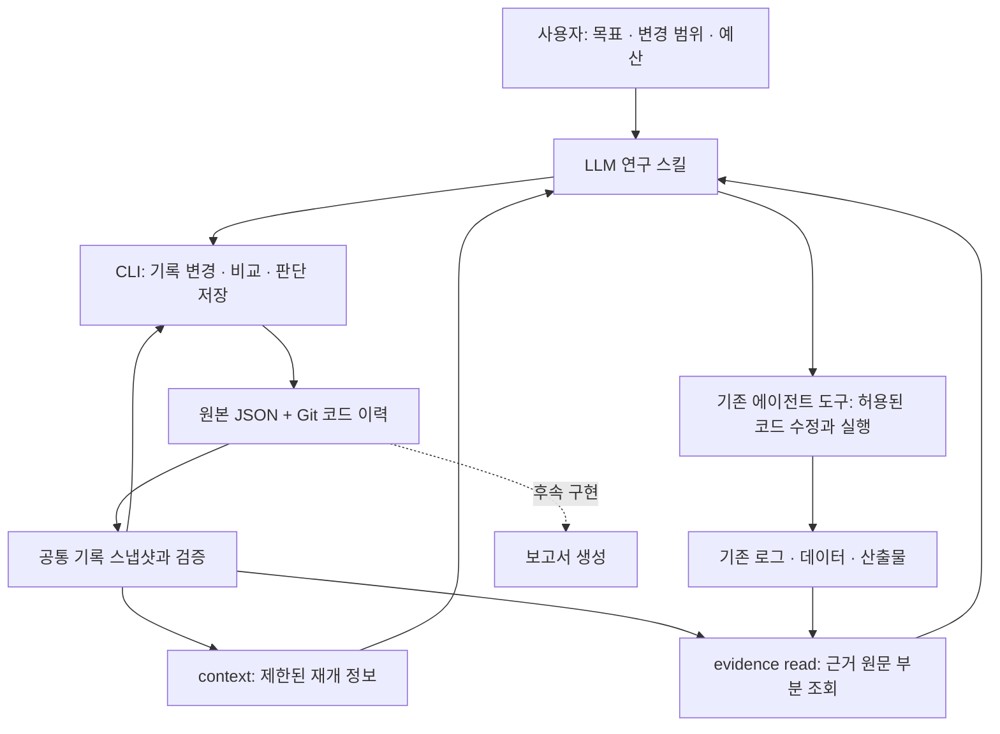

# zihoAutoResearch

**LLM이 기존 ML 프로젝트를 이해하고 전처리·학습·검증을 점검하며, 코드 수정과 실험을 반복하도록 돕는 가벼운 연구 도구.**

사용자가 선택한 기존 환경과 실행 명령을 활용하며, Git 코드 커밋과 후속 실험 기록 커밋을 연결해 연구 이력을 쌓습니다. 대회에서는 주최측 데이터·평가 지표·제출 규칙을 읽고, 로컬 검증 결과와 제출 점수를 실험 변경에 연결합니다. Docker나 별도 실행 플랫폼은 초기 범위에 포함하지 않습니다.

## 작업 흐름

프로젝트 이해 → 연구 지침 작성 → 현재 실험 점검 → 유효한 기준 확보 → 가설·코드 수정 → 실행·비교 → 유지·되돌리기·보류 → 다음 실험

카파시의 AutoResearch에서 작은 연구 지침과 반복 실험 방식을 가져옵니다. 여기에 기존 프로젝트 이해, 전처리·학습의 근거 기반 점검, 제출 결과 연결을 보완합니다. 전체 파이프라인을 연구 대상으로 삼으며 특정 데이터셋에 제품을 고정하지 않습니다.

## 아키텍처

현재 구조는 연구 판단, 원본 기록, 재개용 조회를 분리합니다. 스킬이 프로젝트를 해석하고 판단하며 CLI는 기록·검사·비교와 근거 조회를 담당합니다. 상세 계약은 [맥락 조회와 근거 재조회](docs/context-and-evidence.md)를 따릅니다.




CLI는 LLM 호출·학습 실행·코드 되돌리기·대회 제출을 수행하지 않습니다. 실제 사용 중 실행은 기존 에이전트 도구가 맡으며, 도구 개발 검증에서는 로그와 점수를 모의 데이터로 대체합니다.

## 현재 상태

로컬 CLI의 JSON 저장·검증 기반과 `init`, `project set`, `status`, `check`, `review add`, `submission add`, `experiment create/update/correct/compare/decide`, `git status`, `experiment create --git-head`, `context`, `evidence read`를 구현했습니다. [LLM용 스킬](skills/ziho-autoresearch/SKILL.md)과 실행 가능한 [모의 연구 예제](examples/mock-cycle.py)를 제공합니다. 보고서 생성 명령은 후속 구현 범위입니다. `check`는 기록의 형식·연결·근거 파일을 검사하며 ML 과정의 타당성을 판정하지 않습니다.

- [맥락 조회·근거 재조회와 구조](docs/context-and-evidence.md)
- [최근 관련 연구와 개선 이슈](docs/research-update-2026-10.md)
- [보고서 필드별 원본 매핑](docs/report-field-mapping.md)
- [Git 기반 연구 이력과 사용 순서](docs/git-research-history.md)
- [현재 제품 정의](docs/product-direction.md)
- [v1 사용 흐름·CLI·파일 계약](docs/cli-and-file-contract.md)
- [실제 학습 없이 확인하는 모의 파일 예제](examples/contract-v1/README.md)
- [연구 절차와 판정 규칙](docs/research-workflow.md)
- [기존 프로젝트 연결과 실행 환경](docs/project-adapter-and-environment.md)
- [프로젝트 연구 지침 템플릿](templates/program.md)
- [실험 기록 템플릿](templates/experiment.md)
- [작업 기록](tasks/todo.md)

목표는 사용자가 적용할 수 있는 도구를 완성하는 것입니다. 스킬은 기존 CLI로 실험 기록·비교·판단·선택을 연결하며, 확인된 제출 결과를 실험·파일 해시와 연결합니다. 다음 구현 범위는 보고서 생성입니다. 제품 개발 중 실제 ML 학습·대회 제출은 하지 않으며, 완성 후 실제 적용은 사용자가 수행합니다.

## 설치와 기본 사용

Python 3.11 이상이 필요하며 실행 시 외부 라이브러리는 필요하지 않습니다. 저장소에서 가상환경을 만든 뒤 설치합니다.

```sh
python -m venv .venv
# Linux/macOS
source .venv/bin/activate
# Windows PowerShell에서는 .venv\Scripts\Activate.ps1
python -m pip install .
zar init --project /path/to/ml-project
zar status --project /path/to/ml-project
```

### LLM 스킬 사용

스킬은 이 저장소와 소스 배포본의 `skills/ziho-autoresearch/` 폴더로 배포합니다. `references/`를 포함한 폴더 전체가 한 단위이며, 외부 저장소 파일 없이 절차와 CLI 입력 방법을 읽을 수 있습니다. wheel은 CLI를 설치하며 스킬을 포함하거나 에이전트의 전역 설정에 자동 설치하지 않습니다. 소스 체크아웃 또는 압축 해제한 소스 배포본을 보관하고 기존 에이전트에 다음처럼 경로를 지정해 사용하세요.

> `/absolute/path/to/zihoAutoResearch/skills/ziho-autoresearch/SKILL.md`를 읽고 `/absolute/path/to/ml-project`를 점검해줘. 우선 실행 없이 프로젝트 해석과 누락 정보를 정리해줘.

실험까지 맡길 때는 목표, 허용 변경 경로, 실행 환경, 횟수·시간 한도를 함께 지정하거나 이미 확정한 project.json을 참조합니다. 스킬은 현재 기록을 읽고 미완료 실행을 확인한 뒤 이어갑니다. `keep` 판단, 기록상 선택, 실제 작업 폴더의 코드는 각각 확인합니다. 모든 지침이 설치된 에이전트에서 자동 발견된다고 보장하지는 않습니다.

### 학습 없이 한 사이클 확인

위 CLI 설치 후, 저장소에서 실행합니다. 출력 경로는 **존재하지 않는 새 폴더**이고 그 상위 폴더는 있어야 합니다.

```sh
python examples/mock-cycle.py --output /tmp/zar-mock-adopt
python examples/mock-cycle.py --output /tmp/zar-mock-hold --scenario scope-mismatch
```

Windows에서는 `/tmp/...` 대신 존재하는 임시 폴더 아래의 새 경로를 지정하세요. 예제는 기준/후보의 가짜 코드·로그·시각·점수를 생성하고 CLI로 초기화 → 기준 선택 → 후보 기록 → 비교 → 판단 → 선택/보류 → check/status를 수행합니다. 학습 명령은 호출하지 않습니다. 예제의 고정 판단은 모의 시나리오이며 실제 연구의 자동 채택 정책이 아닙니다.

각 출력 폴더에 `project/.autoresearch/` 기록, 호출과 진단의 `events.json`, 결과의 `summary.json`, 제한된 조회의 `context.json`, 원문 발췌의 `evidence-page.json`을 보존합니다. 기본 예제는 정확한 0.1 개선으로 후보를 선택합니다. scope-mismatch 예제는 proxy/full 불일치로 후보를 보류하고 기준 선택을 유지합니다. 이때 작업 폴더에는 후보 코드가 남으므로 `workspace_matches_selection:false`를 명시합니다. 기록상 선택이 코드를 복구하지 않는다는 예제입니다. 기존 출력 폴더는 덮어쓰지 않으며 재실행에는 새 경로를 사용합니다.

### 필요한 맥락과 근거만 읽기

```sh
zar context --project /path/to/ml-project --experiment exp-candidate-1 --max-bytes 16384 --json
zar evidence read --project /path/to/ml-project --kind experiment --id exp-candidate-1 --pointer /execution/evidence/0 --max-lines 80 --json
```

`context`는 기록의 형식·참조를 확인하고 선택/후보/미완료/실패 정보를 제한된 크기로 제공합니다. 전체 로그의 존재·해시는 확인하지 않으며 `evidence_not_checked`를 명시합니다. 누락 카드와 잘린 필드를 확인하고 `next_offset`과 `--snapshot`으로 이어 읽습니다.

`evidence read`는 등록된 근거의 해시와 원문을 같은 스트림에서 확인하며 UTF-8 줄을 그대로 반환합니다. 등록 해시가 바뀌었으면 내용을 반환하지 않습니다. 해시가 없는 파일은 미검증으로 표시하고, 다음 페이지에는 이전 `actual_sha256`을 `--sha256`으로 전달할 수 있습니다. 원본은 자동 보관·복원하지 않습니다. 전체 근거 검사는 기존 `check`, ML 해석은 스킬이 담당합니다. 정확한 상한·오류·동시 변경 한계는 [조회 계약](docs/context-and-evidence.md)을 참고하세요.

### 프로젝트 설정과 검사

초기화는 `.autoresearch/`만 생성하고 기존 코드·루트 `program.md`·`AGENTS.md`를 보존합니다. `--project`를 생략하면 현재 폴더를 사용하며 상위 폴더를 탐색하지 않습니다.

생성된 `.autoresearch/project.json`을 별도 파일로 복사해 목표·비교 조건·명령·예산·수정 허용 경로를 채웁니다. `environment.os`는 사용자가 `windows`, `linux`, `macos`, `other` 중 선택하고 `runtime`, `device`도 직접 기록합니다. 기록된 명령은 실행하지 않습니다.

```sh
zar project set --project /path/to/ml-project --file edited-project.json
zar status --project /path/to/ml-project --json
zar check --project /path/to/ml-project --json
```

`project set`은 현재 revision의 전체 수정본을 받아 검증 후 revision을 올립니다. ID·생성 시각은 유지하고 updated_at은 CLI가 기록합니다. 같은 comparison ID의 조건을 바꾸려면 새 ID를 지정합니다. 미완성 설정도 저장할 수 있으며 `status`는 누락을 보여주고 `check`는 종료 코드 3을 반환합니다. 성공은 0, 인자·형식 오류는 2, 상태·참조 충돌은 3, 파일·잠금 오류는 4입니다.

CLI는 `.autoresearch/.lock`으로 동시 접근을 조정하며 잠금이 있으면 자동 삭제하지 않습니다. 중단으로 잠금이 남으면 실행 중인 CLI가 없는지 확인한 뒤 수동으로 복구합니다. `init`은 프로젝트 루트의 `.autoresearch.init.lock`을 사용합니다. CLI 밖의 동시 파일 편집은 보호하지 않습니다.

`check`는 저장된 review/experiment/submission 파일도 검사합니다. 파일 근거의 누락·해시 미기록·변경과 확인하지 못한 코드/데이터 최신성은 진단으로 표시하고 URL에 접속하지 않습니다. 실제 ML 실행이나 제출 없이 테스트합니다.

```sh
python -m unittest discover -s tests -v
```

현재 실행 검증 환경은 macOS입니다. Windows/Linux 실기기 동작은 아직 확인하지 않았습니다. 아키텍처 그림은 후속 기능까지 포함한 v1 목표 구조입니다.

## 실험 생성과 관측 결과 기록

설정을 채운 프로젝트에서 [생성 입력 예제](examples/experiment-create.json)를 복사하고 실험 ID·가설·코드/설정 식별자·명령을 실제 프로젝트에 맞게 수정합니다.

```sh
zar experiment create --project /path/to/ml-project --file experiment-create.json
zar experiment update exp-baseline-1 --project /path/to/ml-project --file experiment-update.json
```

`create`는 현재 comparison/environment를 복사하고 `planned` 기록을 만듭니다. 설정 누락, 실험 수 한도, 중복 ID와 존재하지 않는 참조는 거부합니다. `update` 입력은 생성된 `.autoresearch/experiments/exp-baseline-1.json`의 **전체 수정본**입니다. 현재 revision을 유지하고 execution에 실제 관측값을 채우면 CLI가 revision과 updated_at을 갱신합니다.

- `planned → running → succeeded/failed/interrupted/unknown`을 기록합니다. 이미 종료한 실행은 시작·종료 시각과 근거를 갖춰 planned에서 바로 종료 상태로 기록할 수 있습니다.
- `unknown`을 해소하려면 기존 근거와 구별되는 확인 근거를 추가합니다. 새 실행은 새 ID로 기록합니다.
- 계획·이미 기록한 실행 시각·판단은 update로 바꿀 수 없습니다. 종료 결과는 고정하며 산출물만 새 경로로 추가할 수 있습니다. 제출용 산출물은 SHA-256 해시가 필요합니다.

이 명령은 프로세스를 시작하거나 실행 상태를 자동 탐지하지 않습니다. 실험을 생성·갱신해도 project.json의 선택 실험은 바뀌지 않습니다. 새 실험 파일은 소유자 전용 권한으로 생성되고, 이후 갱신은 기존 파일 권한을 유지합니다.

## Git 커밋으로 쌓는 연구 이력

코드·설정을 커밋한 뒤 다음 명령으로 실험을 연결합니다. CLI는 Git 조회만 수행합니다.

```sh
zar git status --project /path/to/ml-project --json
zar experiment create --git-head --project /path/to/ml-project --file /path/to/experiment-create.json
```

`--git-head`는 입력 code_ref를 `git:<전체 HEAD SHA>`로 대체하며 커밋되지 않은 코드·설정 변경이 있으면 거부합니다. `.autoresearch/`의 기록 변경은 허용합니다. 입력 파일은 대상 프로젝트 밖이나 `.autoresearch/drafts/`에 두세요. 실행 결과 JSON은 코드 커밋을 계속 가리키며, 기존 에이전트가 별도의 결과 기록 커밋으로 보존합니다.

추적할 파일·잠금 제외 규칙·실행 직전 확인·검사 한계는 [Git 연구 이력](docs/git-research-history.md)에 정리했습니다. 과거 JSON 예제의 수동 code_ref는 실제 Git SHA가 아닙니다.

## 미실행 취소·시작 미확인·관측 정정

- 실행하지 않은 planned는 `experiment update`로 `cancelled`와 사유 note를 남깁니다. 시작·종료·점수·exit code는 null, artifacts는 []입니다. 미완료 목록에서 닫히고 횟수 예산을 반환합니다.
- 실행 시작 여부를 모르면 note/evidence와 함께 `unknown`을 기록하며 시작 시각을 추정하지 않습니다. 확인 전 재실행하지 않고, 새 근거로 실행 상태를 해소합니다.
- 완료 결과의 오기는 원본을 덮어쓰지 않고 새 정정 ID로 연결합니다.

```sh
zar experiment correct exp-baseline-1 --project /path/to/ml-project --file correction.json
```

정정 입력은 `{id, revision, execution, reason, evidence}`이며 원본 revision과 새 ID를 제공합니다. 같은 실행 계획·산출물을 보존하고 결과만 정정합니다. 새 실행 횟수는 늘지 않으며 새 판단은 비어 있습니다. 선택된 원본은 먼저 선택 해제해야 합니다. 자세한 상태·정정 규칙은 [파일 계약](docs/cli-and-file-contract.md), 향후 보고서의 출처는 [필드 매핑](docs/report-field-mapping.md)을 따릅니다.

## 실험 비교와 판단 기록

생성 입력에 `run_context`를 지정합니다. `scope`는 `proxy` 또는 `full`, `seed`는 정수 또는 미확인 시 null, `budget_ref`는 실행 예산 조건 식별자입니다. [생성 예제](examples/experiment-create.json)의 값은 실제 조건으로 바꾸세요.

```sh
zar experiment compare exp-baseline-1 exp-candidate-1 --project /path/to/ml-project --json
zar experiment decide exp-candidate-1 --project /path/to/ml-project --file decision.json
```

[판단 입력 예제](examples/experiment-decision.json)의 revision은 대상 실험의 현재 값으로 바꿉니다. compare는 조건 일치 여부, 정확한 십진 개선 폭, 명시적으로 연결한 확인 실험의 횟수·분산을 보여줍니다. 미기록 조건·proxy/full 혼합·정정된 baseline은 비교를 제한하고, 근거 확인 한계는 별도로 출력합니다. decide는 사용자의 근거 있는 판단을 이력에 추가하며 코드·Git·현재 선택을 바꾸지 않습니다. 자세한 의미와 기존 기록 호환성은 [비교 계약](docs/cli-and-file-contract.md#8-비교와-submissionsidjson)을 따릅니다.

## 실행 전 점검 기록

`zar review add --project /path/to/ml-project --file review-draft.json --json`으로 점검 결과를 등록합니다. 입력은 `id`, `supersedes_id`, `code_ref`, `data_ref`, `items`이며 생성 메타데이터는 CLI가 채웁니다. 프로젝트 설정이 미완성이어도 점검을 남길 수 있습니다. 입력 예시는 [스킬의 CLI 레시피](skills/ziho-autoresearch/references/cli-recipes.md#register-a-review)에 있습니다.

실험 전 변경 범위·가설과 실제 diff를 대조하고, 데이터 누수·평가 방법 변경·검증하지 못한 항목을 근거와 함께 남깁니다. 등록한 ID를 새 실험의 `review_ids`에 연결합니다. 등록 성공은 점검 내용이나 ML 타당성의 자동 승인을 뜻하지 않습니다. 같은 코드·데이터의 점검 정정은 새 ID와 `supersedes_id`로 원본을 보존하며, 기존 실험 참조는 바꾸지 않습니다. [RRSI 적용 범위](docs/research-update-2026-10.md#rrsi-적용-실행-전-점검)를 참고하세요.

## 확인된 제출 결과 기록

`zar submission add --project /path/to/ml-project --file submission-draft.json --json`은 이미 확인한 외부 점수와 제출 근거를 기록합니다. 먼저 성공한 실험의 artifacts에 role=submission 파일 경로와 SHA-256을 등록해야 합니다. 점수가 아직 없으면 산출물만 보존합니다. 입력 필드는 [v1 계약](docs/cli-and-file-contract.md)과 [CLI 레시피](skills/ziho-autoresearch/references/cli-recipes.md#register-an-observed-submission-result)를 따릅니다.

중복 외부 결과는 거부하고, 정정은 같은 competition/external_id/leaderboard의 활성 기록을 새 ID로 대체합니다. 원본·실험 로컬 점수·판단·현재 선택은 보존됩니다. 실제 파일 해시가 다르면 등록을 거부하며, 파일이 없으면 확인 불가 경고를 남깁니다. CLI는 외부 제출이나 점수 조회를 수행하지 않습니다.
