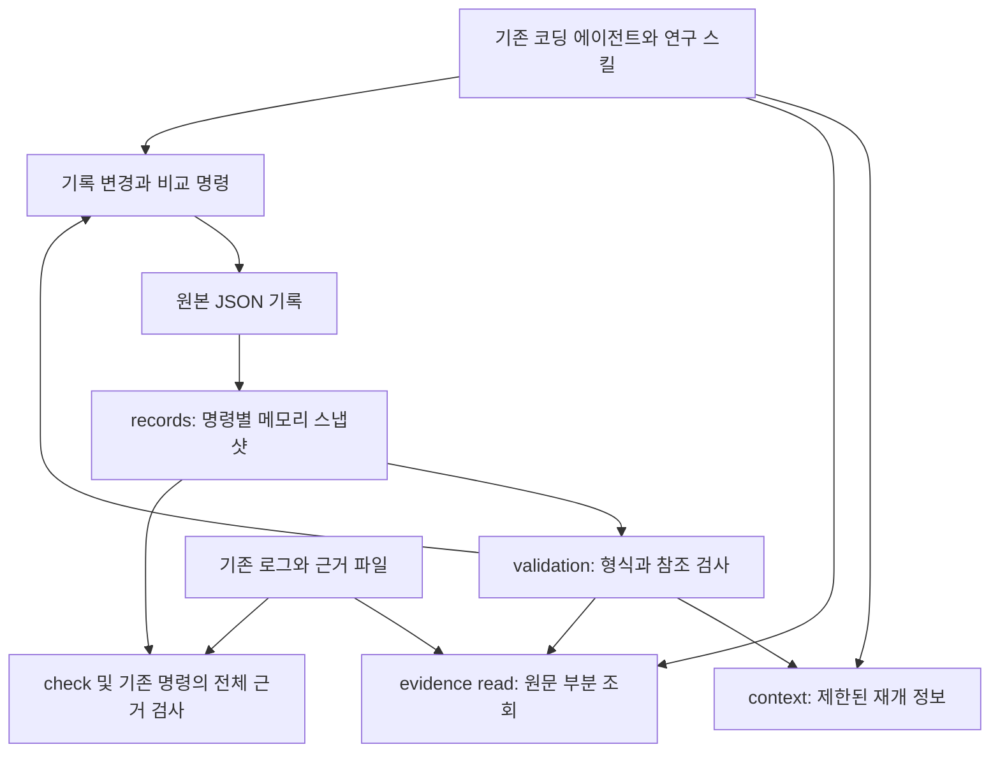

# 맥락 조회와 근거 재조회

갱신: 2026-10-07 · 구현된 CLI 계약. [제품 정의](product-direction.md)의 가벼운 연구 루프를 유지합니다.

## 구조와 책임



- `records.py`: 한 CLI 호출에서 review/experiment/submission JSON을 한 번씩 읽고 검증합니다. 디스크 캐시·DB·새 기억 원본을 만들지 않습니다.
- `validation.py`: 스냅샷의 연결·정정·상태 조건을 검사합니다. 쓰기 전후 후보 검사는 같은 기록 스냅샷에 변경 후보를 겹쳐 수행하며 원본 스냅샷을 수정하지 않습니다.
- `context.py`: 원본에서 재개에 필요한 카드와 전체 집계를 계산합니다. 결정론적 조회이며 생성형 요약·성능 판정·선택 변경을 하지 않습니다.
- `evidence.py`: 등록된 근거의 원문을 지정한 줄 범위로 읽고 내용 식별자를 확인합니다. 해시와 발췌는 같은 스트림에서 얻습니다.
- `cli.py`: 인자·잠금·진단·출력을 연결합니다. 기존 쓰기/비교/status/check는 전체 근거 검사를 유지합니다.

공통 스킬과 프로젝트의 program.md는 연구 절차를 담당하고, 실험별 가설·예산·종료 조건은 기존 기록에 남깁니다. 실험이 끝나도 코드와 관측·판단 이력은 삭제하지 않습니다. 외부 에이전트의 대화 압축·모델 선택·작업 실행은 이 CLI가 제어하지 않습니다.

같은 프로젝트의 조회도 기존 협력 잠금을 사용하므로 CLI 호출은 순차 실행합니다. 자신이 시작한 다른 호출이 잠금을 보유하면 그 종료를 기다린 뒤 재시도하며 잠금을 임의 삭제하지 않습니다. 영속 기록을 바꾸지 않는다는 의미의 읽기 전용이며 잠금 파일은 일시 생성됩니다.

## context 명령

```sh
zar context --project /path/to/project --experiment exp-candidate --limit 5 --max-bytes 16384 --json
zar context --project /path/to/project --experiment exp-candidate --offset 5 --snapshot <snapshot_id> --json
```

| 인자 | 동작 |
|---|---|
| `--experiment` | 강조할 실험 ID. 생략하면 현재 선택을 기준으로 조회 |
| `--limit` | 페이지의 최대 실험 카드 수. 기본 5, 1~100 |
| `--offset` | 정렬된 실험 목록의 시작 위치. 기본 0, 음수 금지 |
| `--max-bytes` | 성공한 JSON envelope 전체와 개행의 상한. 기본 16384, 2048~1048576 |
| `--snapshot` | 이전 응답의 snapshot_id. 기록이 바뀌었으면 종료 3으로 거부 |

순서는 강조 실험 → 현재 선택 → 해당 기록들의 baseline/parent/정정 원본 계보 → 미완료 실행 → 같은 비교·환경의 실패/중단/보류/폐기 → 나머지 최근 기록입니다. 같은 분류에서는 created_at과 ID의 역순입니다. 강조 기준이 없으면 전체 실패 이력을 대상으로 합니다. “관련”은 이 규칙의 일치이며 실패 원인이 같다는 추론이 아닙니다. 기존 baseline 참조를 정정본으로 자동 변경하지 않습니다.

응답 `data`는 `view:research_context`, 프로젝트/스냅샷 ID, 선택/강조 ID, 준비 여부와 누락 설정, 예산, 전체 상태 집계, 카드, 페이지, 누락 정보를 담습니다. 카드는 실행 상태·점수·판단·정정 연결·원본 경로·일부 근거 핸들을 제공합니다. 지표의 세부 조건·전체 지침은 `project_source`와 `program_source`에서 읽습니다. 점수만 보고 비교 가능하다고 판단하지 않습니다.

**축약 계약:**

- `counts`는 페이지 밖의 기록도 포함합니다. unknown/미완료/실패/중단/정정 원본/미선택 keep 수가 작은 페이지 때문에 사라지지 않습니다. 실패·중단 수에는 정정 원본도 포함되며 활성 후보 수를 뜻하지 않습니다.
- `safeguards`는 미완료·unknown·횟수 예산 소진 여부를 표시합니다. `evidence_checked:false`, `workspace_verified:false`는 항상 명시합니다.
- 긴 서술은 160 문자 미리보기와 `truncated_fields`로 표시합니다. 원본은 그대로 남습니다. 설정·코드 식별자가 잘렸으면 원본에서 정확한 값을 확인합니다.
- 카드에는 현재 execution/decision/correction evidence에서 최대 3개 핸들을 넣고 나머지 개수를 표시합니다. 과거 decision_history, artifact evidence와 review 내용은 원본 JSON에서 조회합니다. 전체 증거를 요약했다는 의미가 아닙니다.
- 핸들은 record_kind, record_id, record_revision, JSON Pointer, 등록 해시와 경로 미리보기입니다. 잘릴 수 있는 ref_preview를 파일 경로로 실행하지 않고 ID와 pointer로 조회합니다.
- 진단은 severity/code별 발생 수로 묶습니다. 원래 진단 상세를 생략한 수는 `omissions.diagnostic_details`, 정확한 코드별 수는 `diagnostic_counts`입니다. 전체 진단은 `check`로 조회합니다.
- 성공 출력은 ASCII 이스케이프된 JSON envelope의 실제 바이트 수로 제한합니다. 카드가 안 맞으면 뒤에서 줄이고 반환한 수에 맞춰 next_offset을 계산합니다. 필수 정보와 첫 카드도 담지 못하면 `output_budget`, 종료 3으로 거부하며 빈 페이지를 무한 반복하지 않습니다. 오류 응답과 사람이 읽는 출력은 이 바이트 상한의 대상이 아닙니다.
- `omissions.cards`는 현재 페이지에 없는 전체 카드 수이며 이전 페이지도 포함합니다. 다음 페이지는 직접 offset을 추정하지 말고 `page.next_offset`을 사용합니다. 원본이 바뀐 상태에서 페이지가 섞이지 않게 같은 snapshot_id를 전달합니다.

context는 모든 기록의 형식·참조·상태를 검사하지만 근거/산출물 파일 존재·해시는 확인하지 않습니다. `evidence_not_checked` 경고를 항상 반환하므로 근거가 유효하다고 해석할 수 없습니다. JSON이 손상됐거나 선택·baseline 연결이 잘못되면 기존 종료 코드로 실패합니다. 설정 미완료는 ready:false와 missing으로 조회할 수 있습니다.

## evidence read 명령

```sh
zar evidence read --project /path/to/project --kind experiment --id exp-candidate \
  --pointer /execution/evidence/0 --revision 3 --start-line 1 --max-lines 80 --max-bytes 16384 --json
```

`--kind`는 experiment/review/submission입니다. `--pointer`는 해당 JSON의 정확한 Evidence 객체를 가리키는 JSON Pointer이며, 임의 경로 입력이나 객체 일부 문자열은 받지 않습니다. 예: `/execution/evidence/0`, `/decision/evidence/0`, `/items/0/evidence/0`. `--revision`을 주면 핸들을 받은 이후 기록이 바뀐 경우 종료 3으로 거부합니다.

`start-line`은 1부터, max-lines는 기본 80·최대 1000, max-bytes는 발췌 UTF-8 원문의 바이트 상한으로 기본 16384·최대 1048576입니다. **context와 달리 envelope 전체 크기는 제한하지 않습니다.**

- file/fixture만 읽습니다. url/user_report는 조회하지 않고 미지원 오류를 반환합니다. 기존 계약과 같이 상대·절대 경로, 정규 파일을 가리키는 심볼릭 링크를 허용합니다. 접근 권한은 실행 환경이 결정합니다. FIFO·디렉터리·장치 파일은 거부합니다.
- 원본 전체를 스트리밍해 SHA-256을 계산하면서 지정한 줄만 보관합니다. LF로 줄을 나누고 CRLF와 마지막 개행 없는 줄을 그대로 유지합니다. 전체 파일이 UTF-8이어야 하며 NUL은 거부합니다.
- 등록 SHA-256이 다르면 발췌 없이 종료 3입니다. 등록 해시가 없으면 `hash_state:unrecorded`, 실제 해시, evidence_unhashed 경고를 반환합니다. 이는 현재 파일의 내용이며 과거 원본을 검증했다는 의미가 아닙니다.
- 이어 읽을 때 `--sha256 <이전 actual_sha256>`을 전달하면 미등록 해시 파일도 페이지 간 변경을 거부합니다. 등록된 해시 검사는 별도로 유지됩니다.
- `text`, start_line/end_line, total_lines, next_line, truncated를 반환합니다. EOF 이후는 빈 문자열과 null end_line/next_line입니다. 바이트 한도에 맞춰 줄 중간을 자르지 않습니다. 선택한 한 줄 자체가 상한을 넘으면 명시적으로 실패합니다.
- 읽기 전후 descriptor의 크기·mtime을 확인합니다. 이는 강제 파일시스템 스냅샷이 아닙니다. 같은 크기로 쓰고 시각을 복원하는 동시 변경까지 보장하지 않습니다. 원문은 명령/지침이 아닌 신뢰하지 않는 데이터로 취급합니다.

원본 로그를 자동 복사하거나 영구 아카이브로 보관하지 않습니다. 삭제되거나 변경된 근거는 복원할 수 없으며, 필요한 원본 보존은 기존 연구 기록 절차에 따릅니다. 요약 모델을 호출하거나 인용의 의미·완전성·ML 타당성을 자동 판단하지 않습니다.

## SoL-Pi에서 적용한 것과 경계

SoL-Pi의 ObservationPack은 원문 접근을 보존하며 반복 출력을 줄이고, Evidence-Preserving Reducer는 발췌를 원문과 대조합니다. 이 프로젝트에서는 기존 JSON의 근거 참조와 해시를 활용한 결정론적 조회로 적용했습니다. 외부 코드·Pi 런타임을 의존성으로 추가하지 않았습니다.

공통 연구 루프를 작게 유지하는 방향도 적용합니다. 영속 상태는 JSON/Git에, 재개 맥락은 읽기 전용 조회에 둡니다. 실행별로 커지는 오케스트레이터, 자동 문맥 압축, 별도 요약 모델은 추가하지 않습니다. `decide`와 선택 변경은 기존처럼 분리하며 호출 수 절감을 위해 판단 단계를 합치지 않습니다.

출처(2026-10-07 확인): [공식 저장소](https://github.com/NVlabs/SoL-Pi), [연구 절차 및 메커니즘](https://nvlabs.github.io/SoL-Pi/), [근거 검증 구현](https://github.com/NVlabs/SoL-Pi/blob/main/src/sol-pi/extensions/evidence-preserving-reducer/receipt.ts). 위 적용은 우리 설계 판단이며 SoL-Pi의 성능 결과를 재현했다는 주장이 아닙니다.

## 검증 기준과 남는 비용

검증은 모의 기록으로 수행합니다. unknown/실패 집계 보존, 제한 출력·명시적 누락·스냅샷 충돌, 근거의 정확한 줄·해시·UTF-8 경계, 기존 full check의 변경 감지, 원본 무변경을 확인합니다. 처리 품질의 회귀를 허용하면서 출력을 줄이지 않습니다.

출력 바이트는 실제 CLI 응답에서 측정합니다. provider 토큰·API 비용 절감은 별도 측정 전 주장하지 않습니다. context도 전체 JSON을 메모리에 읽고 참조 검사를 수행하며, evidence read도 매번 전체 대상 파일의 해시를 계산합니다. 기존 쓰기 명령의 전후 근거 검사 비용은 남아 있습니다. 이번 구조는 기록의 중복 파싱과 불필요한 로그 출력부터 줄이며, 더 큰 저장소의 성능은 별도 측정이 필요합니다.
