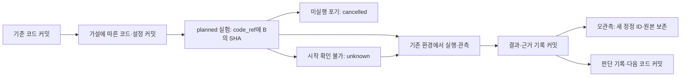

# Git 기반 연구 이력

갱신: 2026-10-04 · [제품 정의](product-direction.md)와 [CLI 계약](cli-and-file-contract.md)을 따릅니다.

## 코드와 결과를 연결하는 단위

기본 연구 방식은 코드·설정을 Git 커밋으로 쌓고, 각 실험의 결과와 판단을 해당 커밋에 연결하는 것입니다. Docker나 별도 실행 서비스를 추가하지 않습니다. Git은 코드 이력을 보존하며 실행 환경이나 ML 타당성을 보증하지 않습니다.

**코드 커밋과 결과 기록 커밋은 구분합니다.** 결과 JSON의 code_ref는 실행에 사용할 코드 커밋을 가리킵니다. 결과 JSON에 그 JSON 자체를 포함하는 커밋 SHA를 쓰지 않습니다. 결과 기록 커밋은 Git 이력으로 찾고, 후속 기록을 위해 code_ref를 바꾸지 않습니다. JSON이 실험 상태의 원본이며 커밋 메시지에서 상태·점수를 파싱하지 않습니다.

## 기록 대상

| Git에 남길 것 | 경로·버전·해시로 연결할 것 |
|---|---|
| 코드, 작은 실행 설정, 의존성 명세 | 원본 데이터, 모델 체크포인트, 대용량 로그·예측 파일 |
| `.autoresearch/project.json`, `program.md` | 외부에 보관한 데이터/산출물의 위치와 내용 식별자 |
| reviews/experiments/submissions의 작은 JSON | 대회에서 받은 외부 점수와 출처 |

잠금·임시 파일은 커밋하지 않습니다. 대상 프로젝트의 `.gitignore`에 `.autoresearch/.lock`, `.autoresearch.init.lock`, `.autoresearch-init-*/`, `.autoresearch/**/.zar-*`를 추가합니다. `.autoresearch/` 전체를 무시하면 연구 기록이 Git에 남지 않습니다. 사용자 프로젝트의 `.gitignore`는 CLI가 자동 수정하지 않습니다. 민감정보나 대회 규칙상 공개할 수 없는 데이터도 커밋하지 않습니다.

## 사용 순서

1. 기존 에이전트가 프로젝트의 Git 상태와 사용자 변경을 읽습니다. 맡은 변경만 명시적으로 스테이징하고 코드·설정 커밋을 만듭니다. 사용자 변경을 몰아서 커밋하지 않습니다. 무관한 사용자 변경 때문에 Git 연결 생성이 막히면 생성을 미루거나, 합의된 커밋 상태의 별도 Git worktree에서 진행합니다. 사용자 파일을 자동 stash/commit/reset하지 않습니다. 별도 worktree의 코드와 연구 기록은 명시적으로 통합한 뒤 worktree를 삭제합니다.
2. `zar git status --project <root> --json`으로 HEAD와 코드 변경, 연구 기록 변경을 확인합니다.
3. `zar experiment create --git-head --project <root> --file <input.json>`을 실행합니다. 생성 입력은 기존 형식 그대로이며 입력의 code_ref는 CLI가 `git:<전체 HEAD SHA>`로 대체합니다. 입력 파일은 프로젝트 밖 또는 `.autoresearch/drafts/`에 두어 미추적 코드 변경으로 간주되지 않게 합니다.
4. 실행 직전에 Git 상태를 다시 확인합니다. HEAD가 결과 기록 커밋 때문에 이동했다면 기록된 코드 SHA와 현재 코드·설정의 차이를 확인합니다. 코드가 달라졌고 실행하지 않았다면 기존 planned를 이유와 함께 cancelled로 닫고 새 실험을 만듭니다. 실행 시작을 확인할 수 없으면 note·evidence를 갖춘 unknown으로 남기고 확인 전 재실행하지 않습니다. CLI는 실제 명령을 실행하거나 실행 시점을 감시하지 않습니다.
5. 기존 환경에서 얻은 상태·시각·로그·점수를 `experiment update`로 기록합니다. code_ref·계획·이미 기록한 시각은 보존합니다.
6. 변경한 실험 JSON과 필요한 연구 지침을 명시적으로 스테이징해 결과 기록 커밋을 만듭니다. keep/discard/hold 판단과 다음 행동도 JSON에 기록하고 후속 커밋에 남깁니다. 점검·비교·판단·제출 결과는 review add/experiment compare/experiment decide/submission add로 기록·조회합니다. report는 JSON에서 읽기용 Markdown을 생성하며, 명령을 우회해 불변 기록을 직접 수정하지 않습니다.
7. 다음 가설은 선택한 코드 기준에서 진행합니다. 실패 이력은 지우지 않습니다. 복구가 필요하면 기존 에이전트가 자신의 변경 범위를 확인해 복구 커밋을 만들고 사용자 변경을 보존합니다. CLI는 reset/checkout/revert/commit/push를 실행하지 않습니다.

## Git 검사 범위와 한계

현재 구현:

- `zar git status`: 저장소 루트·전체 HEAD SHA·code_ref·코드 변경 목록·연구 기록 변경 목록을 반환합니다. init 전에도 조회할 수 있습니다.
- `experiment create --git-head`: 저장소와 최소 한 개 커밋이 있어야 합니다. `.autoresearch/`와 내부 잠금 외의 staged/unstaged/untracked 변경이 있으면 종료 코드 3으로 거부합니다. 저장소 하위 프로젝트에서는 저장소 전체 코드 변경을 보수적으로 검사하며 해당 프로젝트의 연구 기록만 제외합니다.
- Git 실행 파일을 시작하지 못한 OS 오류는 종료 코드 4, Git 명령 거부·저장소/커밋 부재·조회 중 HEAD 변경·조회 시간 초과는 3입니다.
- `--git-head` 없는 기존 모의·비Git 기록은 유지됩니다. 수동 code_ref는 CLI가 Git 커밋으로 확인했다고 간주하지 않습니다. Git 조회는 Git 실행 파일이 필요하며 추가 Python 패키지는 필요하지 않습니다.

이 검사는 **생성 시점의 Git 관측**입니다. ignored 파일·외부 설정·환경·데이터 등 Git 상태에 나타나지 않는 입력은 포함하지 않습니다. 실행 전후 code/config/data 식별자와 근거를 별도로 확인해야 합니다. 저장소를 복제·정리해 커밋이 사라지면 참조 복구가 필요하며, check가 과거 Git 커밋 존재나 실제 실행 일치를 자동 검증하지는 않습니다. CLI 밖에서 동시에 변경하는 작업도 잠금으로 막지 않습니다.

## 종료 관측의 정정

`zar experiment correct <old-id> --file <json>`은 같은 실행의 관측을 새 ID로 정정합니다. 입력은 `{id, revision, execution, reason, evidence}`이고 기존 레코드의 계획·코드 SHA·환경·비교 조건을 그대로 복사합니다. 현재 프로젝트 설정이나 결과 기록 커밋 SHA로 바꾸지 않습니다. 선택된 원본은 먼저 선택을 해제해야 하며, 후속 정정이 없는 succeeded/failed/interrupted만 대상입니다.

원본은 바뀌지 않고 새 레코드의 correction에 원본 ID·사유·근거가 남습니다. 새 판단은 null/history []에서 시작하고 artifacts는 원본과 동일합니다. 산출물 추가는 이후 update를 사용합니다. 정정은 새 실행 예산을 쓰지 않습니다. 기존 제출과 실험 참조는 원본을 계속 가리키며 대체 사실만 표시합니다. 정정 JSON도 후속 기록 커밋에 남깁니다.
