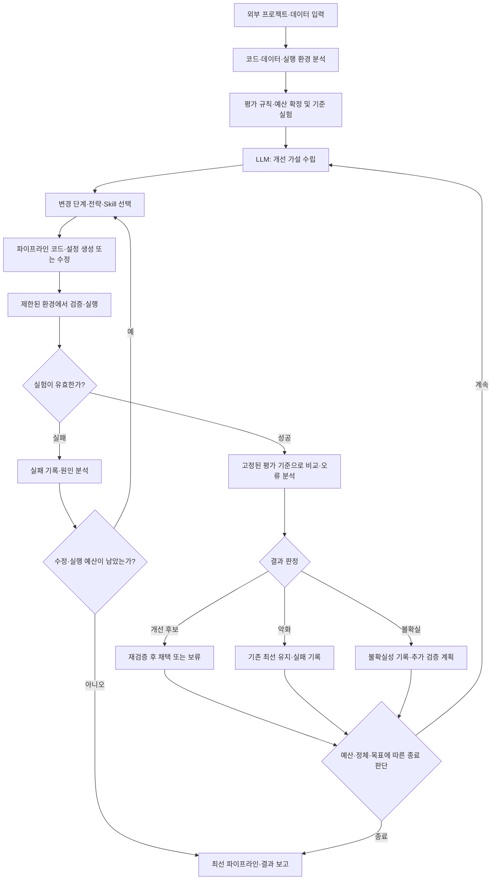

# 제품 정의와 설계 방향

기록일: 2026-10-02

이 문서는 초기 대화에서 합의한 제품 목표와 논의한 설계 방향을 보존합니다. API, 구현 기술 및 상세 실행 정책을 확정한 구현 명세는 아닙니다.

## 1. 확정한 제품 목표

> zihoAutoResearch는 LLM이 ML 파이프라인을 생성·실행·평가·수정하는 그래프 기반 연구 루프를 통해, 주어진 자원 안에서 더 나은 전체 파이프라인을 찾아내는 도구다.

핵심은 **어떤 데이터 처리와 모델·학습 전략의 조합이 더 좋은지 실험으로 확인한 전체 파이프라인을 LLM이 만들어주는 것**입니다.

사용자는 외부 ML 프로젝트를 가져옵니다. LLM은 코드, 데이터, 목표와 기존 실험을 분석하고, 적절한 전처리·피처·모델·loss·optimizer·학습 설정을 판단합니다. 추천 문서에 머무르지 않고 실행 가능한 파이프라인 코드를 생성하거나 기존 코드를 수정합니다.

제품은 하나의 데이터셋이나 특정 ML 주제에 종속되지 않습니다. 다만 범용적인 제품 목표와 실제 초기 지원 범위는 구분하며, 지원하지 못하는 프로젝트는 진단할 수 있어야 합니다.

## 2. 해결하려는 문제

LLM이 한 번 선택한 시나리오가 항상 좋은 결과를 내지는 않습니다. 결측값 처리, 이상치 처리, 피처 생성, 모델과 학습 설정은 서로 영향을 주며, 개별 단계의 타당성만으로 전체 성능을 판단할 수 없습니다.

예를 들어 평균 대체와 이상치 제거가 데이터 품질 검사를 통과하더라도 예측에 필요한 신호를 없앨 수 있습니다. 따라서 선택한 전략을 검증 가능한 가설로 취급하고 실제 학습 결과로 비교해야 합니다.

탐색 공간을 초기 파라미터 목록에 고정하지 않는 것이 중요한 설계 목표입니다. LLM은 실험 결과에 따라 파라미터 범위뿐 아니라 전처리 방식, 피처 구성, 모델 계열 및 학습 전략까지 연구 대상을 바꿀 수 있어야 합니다. 기존 하이퍼파라미터 탐색 도구는 개별 연구 단계에서 활용할 수 있습니다.

## 3. 입력과 출력

### 입력

- 외부 프로젝트 코드와 데이터 또는 접근 경로
- 해결할 문제와 성공 기준: 코드와 문맥에서 추론하되 모호하면 사용자 확인
- 사용 가능한 실행 환경 및 자원 예산
- 기존 모델, 설정, 실험 결과가 있다면 관련 자료

### 출력

- 예산 안에서 검증한 최선의 전체 파이프라인 코드와 설정
- 학습 모델, 평가 결과 및 재현 정보
- 실험별 가설·변경 사항·결과·판단 근거·후속 연구 기록

개선이 없으면 기존 기준 모델을 유지하고, 시도한 가설과 한계를 보고합니다. 성능 향상이나 전역 최적값을 보장하는 제품으로 정의하지 않습니다.

## 4. 개념적 그래프 루프

그래프는 실행 경로를 관리하고, LLM과 탐색 정책은 다음에 검증할 가설과 전략을 결정합니다. 그래프를 도입하거나 반복 횟수를 늘리는 것만으로 최적성이 생기지는 않습니다.

### 두 종류의 루프

| 루프 | 목적 | 예시 |
|---|---|---|
| 단계 내부 검증 | 실험이 올바르게 실행되는지 확인 | 스키마 오류, 데이터 누수, 학습 실패를 진단하고 제한된 재시도 |
| 전체 성능 개선 | 전체 파이프라인의 실제 개선 여부 확인 | 학습 결과에서 전처리·피처·모델·학습 전략으로 돌아가 가설 수정 |

데이터 품질 기준 통과는 성능 개선의 증거가 아닙니다. 학습·평가 결과가 이전 처리 단계까지 되돌아갈 수 있어야 합니다.

### 의존성과 실험 분기

결측값 처리·이상치 처리·피처 생성은 항상 독립적이지 않습니다. 의존성이 있으면 순차 실행하고, 서로 다른 대안은 별도 후보 파이프라인으로 비교합니다. 동일 데이터를 수정한 결과를 무조건 병렬 병합하지 않습니다.

전체 조합을 탐색하되 개별 실험의 변경 범위를 명시하고 가급적 좁혀 결과를 해석합니다. 여러 요소를 함께 바꾼 실험은 개선 원인을 하나로 단정하지 않고 필요 시 추가 비교 실험으로 확인합니다.

## 5. 구성 요소와 책임

| 구성 요소 | 책임 |
|---|---|
| Project Context / Adapter | 프로젝트 구조와 실행 경로 파악, 학습·평가·산출물 인터페이스 연결 |
| Research Agent | 실험 기억과 관측 결과를 바탕으로 가설·전략·다음 실험 선택 |
| Skills | 데이터 분석, 전처리, 피처 생성, 모델 선택, 학습, 평가, 오류 분석 등 연구 방법 제공 |
| Experiment Runner | 후보 코드·설정 적용, 격리된 실행, 로그와 산출물 수집, 자원 제한 |
| Evaluation / Judge | 규칙에 따른 유효성·개선 검사와 증거 해석, 채택·폐기·재검증 결정 |
| Experiment Memory | 가설·변경·결과·판정·계보를 저장하고 다음 연구에 제공 |
| Graph Controller | 상태 전이, 조건부 분기, 재시도 한도, 복구와 종료 제어 |

이 역할 구분은 개념적 책임 분리입니다. 역할마다 별도 LLM 에이전트나 프로세스를 둘지는 아직 결정하지 않았습니다.

AGENTS.md는 연구 운영 규칙을, Skills는 상황별 연구 방법과 도구 사용 절차를 담는 방향을 논의했습니다. 문서 지침만으로 강제되지 않는 평가 보호와 자원 제한은 실행 코드에서 보장해야 합니다. 프로젝트용 실제 AGENTS.md와 Skills는 후속 설계·구현 대상입니다.

## 6. 평가와 채택 원칙

- 기준 실험을 먼저 실행하고 재현 가능한 비교 출발점을 확보합니다.
- 학습용 loss는 변경할 수 있지만 비교에 쓰는 평가 지표와 데이터 분할은 고정합니다.
- 전처리의 학습 과정은 학습 데이터에 한정하고, 검증·테스트 데이터 누수를 방지합니다.
- 반복 실험으로 검증셋에 과적합할 가능성을 고려하고 최종 테스트셋은 연구 루프에서 보호합니다.
- LLM이 설명한 개선과 측정된 개선을 구분합니다. 판정은 기록된 실행 결과를 근거로 합니다.
- 유망한 후보는 결과 변동과 재현성을 확인한 뒤 최선 모델로 채택합니다. 반복 횟수와 임계값은 미정입니다.
- 기존 최선 파이프라인을 보존하고 후보는 별도로 실행합니다.
- 실패도 기록하며 중복 실험, 무한 수정, 무의미한 반복을 제한합니다.
- 실험·전체 연구의 자원 예산 및 종료 조건을 둡니다. 구체적인 자원 항목과 강제 방식은 후속 설계에서 확정합니다.

## 7. 실험 기억과 재개

단순 점수 목록을 넘어 다음 정보를 연결해 저장하는 방향입니다.

- 실험 ID, 부모 실험 및 비교 기준
- 가설, 판단 근거, 선택한 Skill, 변경 범위
- 코드 버전·차이, 데이터 식별 정보, 설정, 환경, 시드
- 실행 상태, 로그, 자원 사용, 모델과 예측 등 산출물 위치
- 평가 결과, 유효성 검사, 불확실성, 채택·폐기·보류 사유
- 관측으로 배운 점과 다음에 검증할 가설

관측 사실과 LLM의 추론은 구분합니다. 중단 후에는 현재 최선, 완료된 실험, 실패 이력, 남은 예산과 미완료 상태를 읽고 연구를 재개할 수 있어야 합니다. 저장 스키마와 체크포인트 방식은 미정입니다.

## 8. MVP 방향과 장기 확장

초기 검증 목표는 외부 프로젝트를 연결해 기준 실험을 재현하고, 가설 기반 실험을 여러 차례 수행하며, 중단 후 기록을 읽고 재개하는 전체 루프입니다. 특정 사례로 동작을 검증하는 것과 제품을 그 ML 주제로 제한하는 것은 다릅니다.

실험 기억은 초기 핵심 기능으로 고려합니다. 이후 축적된 가설·행동·결과 trajectory를 연구 정책 평가나 특화 모델 학습에 활용할 수 있지만, 다중 에이전트 구성과 fine-tuning은 초기 구현의 확정 범위가 아닙니다.

## 9. 아직 결정하지 않은 사항

1. 초기 지원 프로젝트 형태, ML 프레임워크 및 데이터 유형
2. 프로젝트 어댑터의 입력·학습·평가·산출물 계약
3. 그래프 라이브러리와 상태 스키마, 실행 노드의 세부 계약
4. LLM 공급자, 코드 편집 도구 및 Skills 인터페이스
5. 로컬·컨테이너·원격 실행 환경과 GPU·의존성 관리
6. 예산 배분, 탐색·활용 균형, 정체 판단 및 종료 정책
7. 개선 채택 임계값, 재검증 절차와 검증셋 과적합 대응
8. 실험 저장소, 산출물 관리, 체크포인트와 복구 방식
9. CLI·UI 형태와 사람이 개입해야 하는 조건

다음 단계는 이 제품 정의를 기준으로 상세 설계와 구현 계획을 작성하는 것입니다. 이번 기록에서는 구현 기술을 선택하거나 연구 실행 기능을 구현하지 않습니다.
